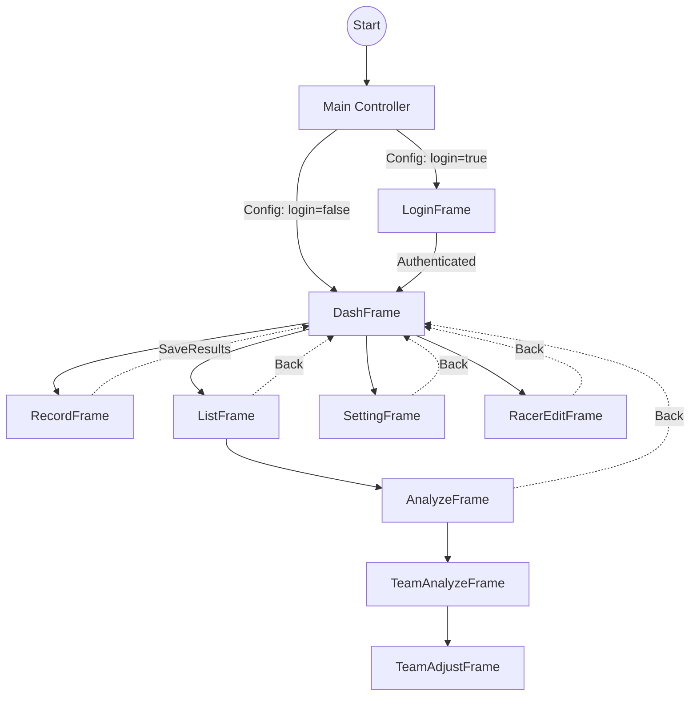

#  RaceLogger

**RaceLogger** is a robust Java-based desktop application designed specifically for university students and cycling enthusiasts who need a professional-grade race data recording and analysis tool without the high cost of specialized hardware.

## 🚀 Overview

Recording race data accurately is crucial for performance analysis. **RaceLogger** provides an intuitive interface for real-time race logging, lap tracking, and detailed performance analysis. Whether you're managing a solo time trial or a complex team event, RaceLogger streamlines the data collection process and provides meaningful insights.

## ✨ Key Features

- **⏱️ Real-time Race Logging**: Record racer IDs, names, lap times, and total elapsed time with millisecond precision.
- **🔄 Session Recovery**: Never lose your data. If the application closes unexpectedly, RaceLogger automatically prompts to recover the last session.
- **📊 Advanced Data Analysis**:
  - Automatically calculate average lap times.
  - Set time and lap limits to filter results.
  - Identify **DNF (Did Not Finish)** participants based on custom criteria.
  - Dedicated **Team Mode** for analyzing performance across groups.
- **👤 Racer Management**: Maintain a persistent database of racers, including names, IDs, and genders.
- **📥 CSV Integration**: All data is stored in standard CSV format, making it easy to export to Excel, Google Sheets, or other analysis tools.
- **🔐 Secure Access**: Optional login system to protect sensitive race data and settings.

## 🏗️ System Architecture

RaceLogger follows a structured navigation flow managed by a central controller. Each frame serves a specific purpose in the race management lifecycle.



## 🛠️ Technical Highlights

- **Template Method Pattern**: The application uses a `TemplateFrame` as a base class for all UI windows, ensuring consistent looks (fonts, icons) and behaviors across the app.
- **High-Precision Threading**: The chronometer in `RecordFrame` runs on a dedicated background thread, decoupled from the Swing Event Dispatch Thread (EDT). This ensures the UI remains responsive while maintaining millisecond-accurate timing.
- **Resilient Persistence**: The app implements an "Append-on-Record" logic. Every time a racer crosses the line, the data is immediately appended to `record.csv`, protecting against data loss in case of hardware failure or power outage.
- **Dynamic Sort & Filter**: Uses `TableRowSorter` and custom comparators to allow real-time ranking and DNF marking during analysis.

## 📊 Data Formats

RaceLogger uses simple, human-readable CSV files for data storage:

| File Type | Path | Format |
| :--- | :--- | :--- |
| **Racers** | `data/racerinfo/racers.csv` | `ID, Name, Gender` |
| **Live Record** | `data/record.csv` | `ID, Name, Time(ms), LapCount` |
| **Settings** | `data/config/settings.csv` | `Key, Value(Boolean)` |
| **Auth** | `data/logininfo/authorization.csv` | `Username, Password` |

## 📁 Project Structure

- `src/controller`: Contains `Main.java` (entry point) and navigation logic.
- `src/frames/`: All UI components (Dashboard, Record, Analyze, Settings, etc.).
- `data/`: (Generated at runtime) Stores race records, racer information, and configuration settings.
- `images/`: Stores UI assets and icons.
- `run.sh`: Convenient shell script for compiling and running the application on Linux.

## 🚀 Getting Started

### Prerequisites

- Java Development Kit (JDK) 8 or higher.

### Installation & Run

1. Clone and navigate:
   ```bash
   git clone https://github.com/AliFuatAkyemis/RaceLogger.git
   cd RaceLogger
   ```
2. Run using the provided script:
   ```bash
   chmod +x run.sh
   ./run.sh
   ```

## 📝 Usage Guide

1. **Racer Setup**: Go to `Racer Edit` to add your athletes. This maps IDs to names.
2. **Recording**: Open `Record`, hit `Start`. When an athlete finishes a lap, type their ID and press Enter (or click `Add`).
3. **Completion**: Click `Save&Exit`. Choose a name for the record file.
4. **Analysis**: Navigate via `Records List` -> Select File -> `Analyze`. Toggle `Team Mode` if you're evaluating team rankings.

## 📄 License

This project is licensed under the MIT License - see the [LICENSE](LICENSE) file for details.

---
*Developed by Ali Fuat Akyemis*
